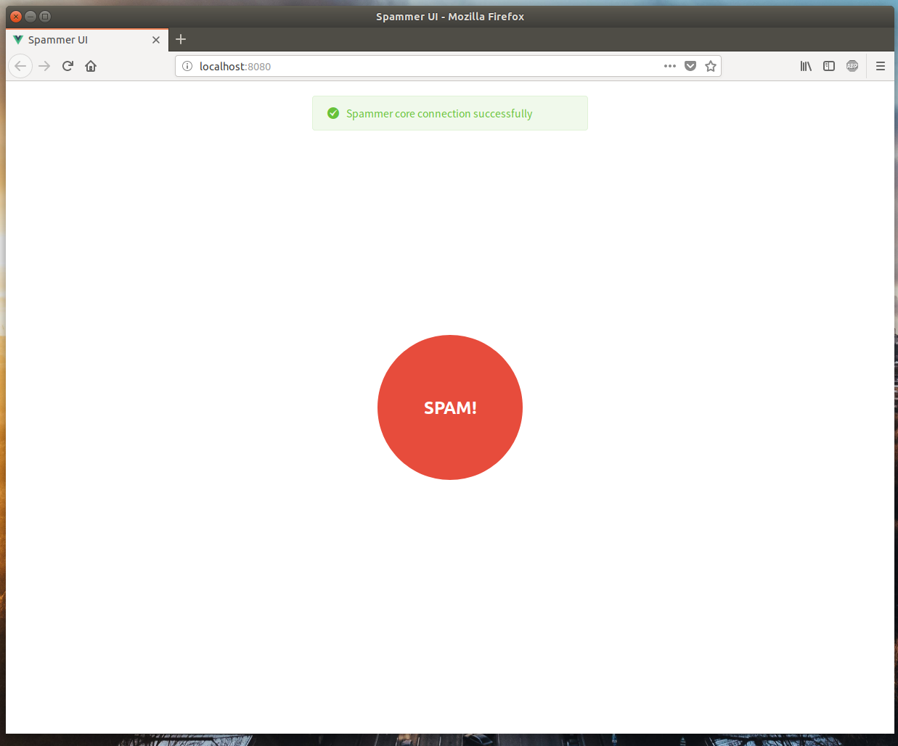
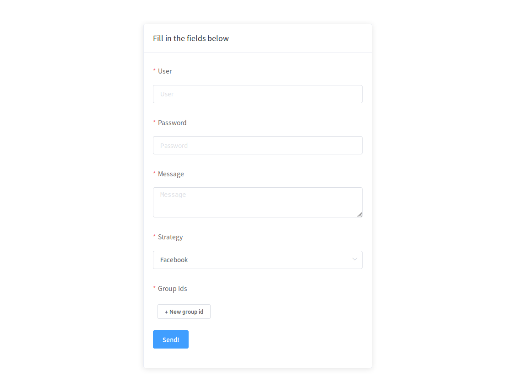

<p align="center">
  <h3 align="center">Spammer UI</h3>
  <p align="center">An UI to facilites access to spammer core.</p>

  <p align="center">
    <a href="http://standardjs.com/">
        
    </a>
  </p>
  
  <p align="center">
    
    
  </p>
</p>

--- 


### Project setup

```sh
# Install deps
npm install

# Compiles and hot-reloads for development
npm run serve

# Compiles and minifies for production
npm run build

# Lints and fixes files
npm run lint
```
